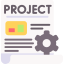

## Hi there 👋, I am Aditya 😄

**I am passionate Software Engineer with 4 years of Experience in professional enterprise Software development. Currently I am employeed at [Therap](https://www.therapservices.net/). I graduated from Bangladesh University of Engineering and Technology (BUET)**

<ul>
    <li>I love backend development and system design</li>
    <li>I am also interested in Machine Learning, LLM development and integration</li>
    <li>⚡ Fun fact: I love to play games, watch movies, listen to music and travel around the world</li>
    <li>📫 How to reach me:  <a href="mailto:adityachakma199@gmail.com">adityachakma199</a></li>
</ul>

More about me on: [github.io](https://aditya-chakma.github.io/portfolio/)

### Programming languages:
`Java`, `C++`, `Python`, `Javascript`, `R`, `C#`, `Rust`

### Tools and Frameworks
***Databases:*** `Oracle DBMS`, `Mysql`, `PostgreSQL`\
***Fronend:*** `HTML`, `CSS`, `React`, `jQuery`, `Javascript`, `Jsp`, `Thymeleaf`\
***Frameworks:*** `Spring MVC`, `Spring Boot`, `Hibernate`, `Kafka`, `Maven`, `Gradle`, `Git`, `Gatling`, `Postman`, `JUnit`\
***Devops:*** `Weblogic`, `Tomcat`, `Nginx`, `Docker`\
***Project management:*** `Jira`, `Trello`, `Slack`\
***Miscilenouse:*** `Microservice`, `Spring Cloud`, `REST`, `SOAP`, `Linux`, `Shell script`, `Bash`

###  Projects:

- 🔭 [Attention](https://github.com/aditya-chakma/Attention-Extension): A manifest V3 google chrome extension.
  - **Tech stacK:** Javascript, ManifestV3
  - **Featuers:** Bookmark timestamp for a youtube video, Remove Youtube shorts, Remove facebook Reels, Block a website
  - **Future scope:** Configuration page, Fix bugs related to bookmark and videos removal, Integrate LLM for web searches.
-  [LCU-Net](https://github.com/aditya-chakma/LCU-net): Implemented Low Cost UNet (LCU-NET) paper from scratch.
-  [Travel Mate](https://github.com/aditya-chakma/Travel-Mate/tree/master): Travel agency project.
  - **Tech stac:** Laravel, MySql
  - **Features:** User registration, Client Registration, Product search, Product payment, Room/Vehicle rent, release.
- [Blood Bank](https://github.com/aditya-chakma/CSE-206-BloodBank-JavaFX): Blood bank client and Admin server modules.
    - **Tech stack:** Java, JavaFX, CSS
    - **Features:** User registration, Request for blood, User notification based on location, Requester notification upon blood confirmaton.

⚡ **Fun projects: (Unity games)** 😄
- [Project Boost](https://github.com/aditya-chakma/Project-Boost)
- [AA2](https://github.com/aditya-chakma/AA2)
- [Argon Asult](https://github.com/aditya-chakma/Argon-Assult)
- [Hitman](https://github.com/aditya-chakma/Hitman)

<!--
**aditya-chakma/aditya-chakma** is a ✨ _special_ ✨ repository because its `README.md` (this file) appears on your GitHub profile.

Here are some ideas to get you started:

- 🔭 I’m currently working on ...
- 🌱 I’m currently learning ...
- 👯 I’m looking to collaborate on ...
- 🤔 I’m looking for help with ...
- 💬 Ask me about ...
- 📫 How to reach me: ...
- 😄 Pronouns: ...
- ⚡ Fun fact: ...
-->
